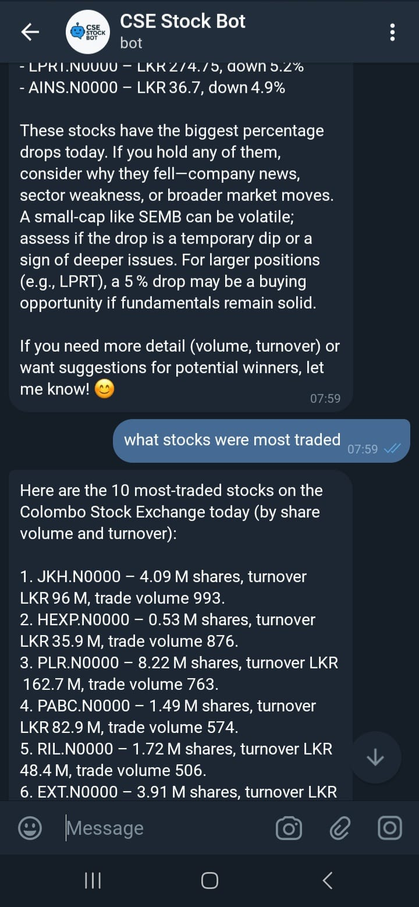

## Agentic AI powered Telegram Bot for Colombo Stock Exchange

Powered by AI, this bot delivers near real-time market updates, in-depth summaries, and strategic financial insights - empowering you to make informed decisions in the fast-paced world of investing in the Colombo Stock Exchange. 🚀✨

📌 **Try it here:** [https://t.me/stocklk_bot](https://t.me/stocklk_bot)

## Features
- ⚡ **Real-Time Data & AI Insights** – Make smarter investment choices with up-to-date market data.
- 📊 **Daily CSE Market Statistics** – Stay informed on key metrics.
- 📈 **Strategic Financial Summaries** – Understand market trends at a glance.
- 🧠 **AI-Powered Q&A** – Ask any investing-related question; specialized in CSE stocks.
- 🌏 **Multi-Language Support** – Interact in English, Sinhala (`සිංහල`), and more.

## Why Use It?
- Supercharge your portfolio with data-driven decisions.
- Expand your investing knowledge while staying on top of market changes.
- Accessible to everyone , **completely free**.

## Tech Stack

 

## Notes
- While the bot strives for accuracy, occasional inaccuracies may occur. Always double-check important information.
- Found a bug or error? Please report it.
- Currently the bot has disabled memory on past interactions to ensure accuracy of data presented - this is an issue that's currently being looked into

---
Made with ❤️ by [Subhanu](https://github.com/subhanu-dev)

